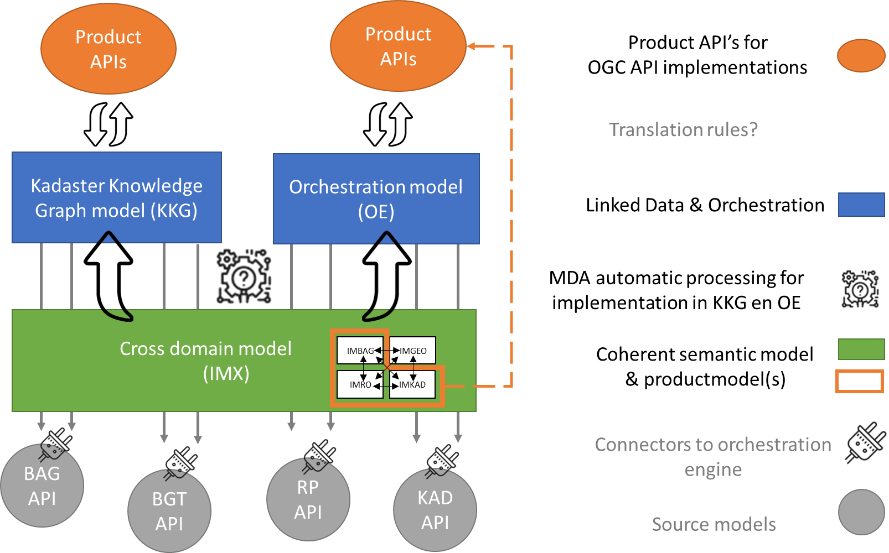

## Use Case: Automatisch vertalen van het cross domain model (IMX) naar implementatiebestanden voor KKG en orchestratie-engine

Binnen een basis- of kernregistratie worden de relaties tussen concepten in het informatiemodel uitgedrukt. Bijvoorbeeld een BAG Nummeraanduiding verwijst naar een BAG OpenbareRuimte. Het cross domain model (IMX) beschrijft de relaties tussen concepten in verschillende basis- en kernregistraties. Bijvoorbeeld de relatie tussen een BRT Gebouw, een BAG Pand en een BGT Pand en Overigbouwwerk. Het is als het ware een semantische (orchestratie)laag over de verschillende registraties heen.

De relaties tussen concepten in verschillende informatiemodellen worden in het cross domain model (IMX) gelegd met o.m. «traces».

Deze «traces» vormen -naast de bestaande relaties in de informatiemodellen- de input voor de Kadaster Knowledge Graph (KKG) en de orchestratie-engine om verbindingen tussen concepten te leggen.

Met deze use case willen we het volgende bereiken:

-   Het MDA geautomatiseerd omzetten van het cross domain model (IMX) naar implementatiebestanden als input voor de KKG en de orchestratie-engine.
-   Het aansluiten van één of meer product API’s op de orchestratielaag op basis van een productmodel als subset van het semantisch model.

### Scope

-   Toepassing op Gebouw+: Cross domain model bevat BAG, BGT\|IMGeo, Ruimtelijke Plannen en perceel en gemeentegrenzen uit IMKAD.
-   ShapeChange als tool om cross domain model (IMX) om te zetten naar implementatiebestanden voor KKG en orchestration engine.
-   Eisen aan cross domain model en implementatiebestanden moeten worden opgesteld.
